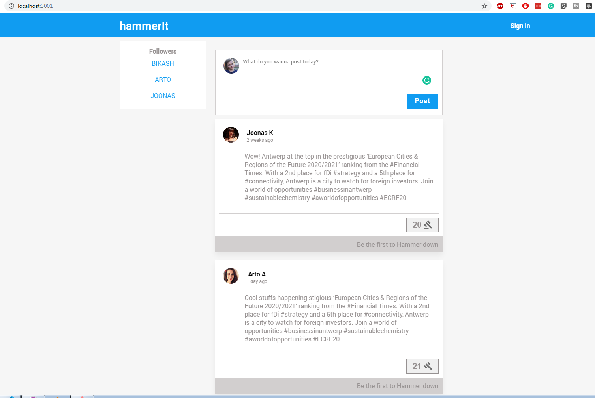
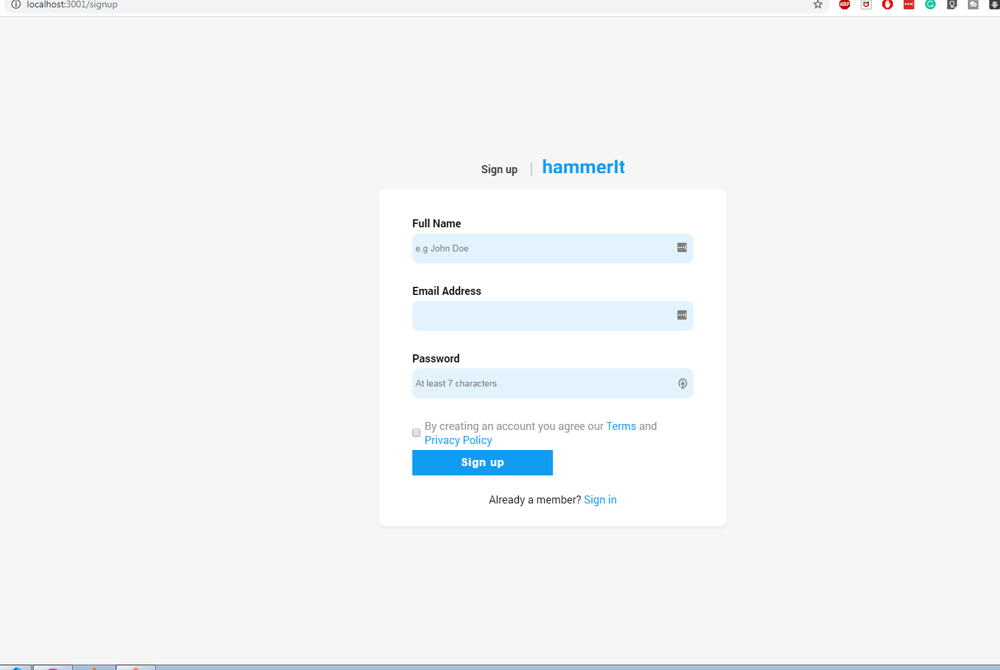

### Check live demo at https://hammerit.netlify.com/

_Social Media concept_

> Users can make posts, browse through others' post and react by giving a hammer ( identical to like reaction)

_Technology used_

- HTML/SCSS
- React
- Redux

_Future plan_

- Authentication + user login and signup
- Create new posts
- update post( Hammer Count)
- Filter post by time or users

_What I have done so far?_

- Created components for Post, Hammer, Post input & Navbar
- Added route /login, /signup, /home
- Styled login page, signup page & home page
- Connected to API so users and Posts are fetched from Google firebase
- Setup redux for proper state management

## How to run?

- Clone my repository or download it
- run `npm install` ( assuming you have react enviroment setup)
- run `npm start`

_Signup page_ 
